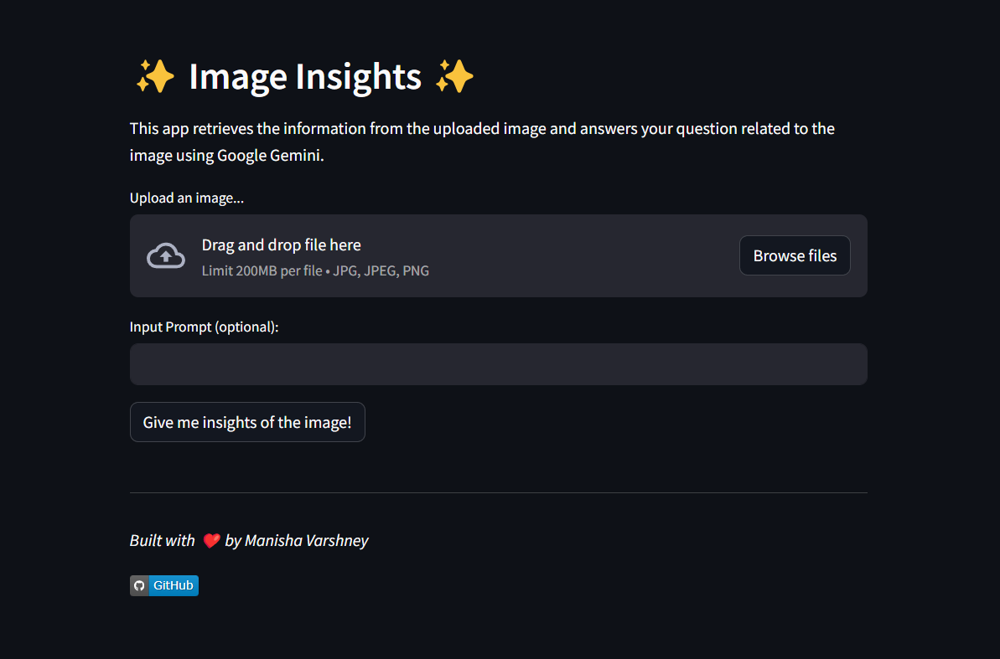

# Image-Insights
ImageInsights is a Python Streamlit app powered by the Google Gemini model for advanced image analysis and description. Users can effortlessly upload images, optionally provide prompts, and receive insightful answers, making it a seamless and intuitive tool for visual data interpretation.
ImageInsights app can be accessed [here](https://image-insights.streamlit.app/)

---

## How It Works
- Upload Image: Choose or drag-and-drop an image directly into the app.
- Optional Prompt: Provide a prompt for more context (optional but enhances accuracy).
- Get Insights: Instantly receive detailed insights and analysis of the uploaded image.

---

## How to Run

1. Clone the repository:
   ```bash
   git clone https://github.com/manisha-v/Image-Insights.git
   cd Image-Insights
   ```
   
2. Install the dependencies
   ```bash
   pip install -r requirements.txt
   ```
   
3. Generate a Google Gemini API key and save it as `API_KEY` in your `secrets.toml` file.
   
5. Run the "app.py" script:
   ```bash
   streamlit run app.py
   ```

6. Open your browser and visit http://localhost:8501 to explore ImageInsights.

---

## Preview

|  |  |  |
|---------|-------------|-----------|

---

## Deployment

The app has been deployed and is accessible through the following link: https://image-insights.streamlit.app/

---

## Contact

I'm always open to new opportunities and collaborations. Feel free to reach out to me through the contact form on my [portfolio website](https://manisha-v.github.io/portfolio/) or via email at [varshney.manisha05@gmail.com](mailto:varshney.manisha05@gmailcom).

Connect me on [LinkedIn](https://www.linkedin.com/in/manisha-varshney-914646191/)  
